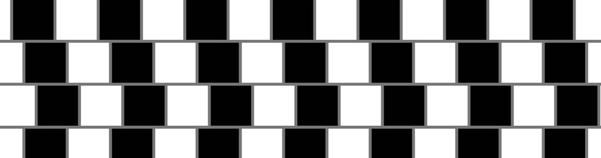

<div align="center">


</div>

A collection of classic optical illusions made with **p5.js**, a JavaSript library for creative coding.

To get started with p5.js, follow the instructions below.

For help in creating each illusion, navigate to the respective folder.

To see the collection in the p5 editor:
https://editor.p5js.org/arthurfincham/collections/u1Rp4mLSq

# Index of Illusions

| Illusion Info                                                                              | Repo                                                                                        | Preview |
| ------------------------------------------------------------------------------------- | ------------------------------------------------------------------------------------------- | ------------------------------------------------------------------------------------------- |
| [Hermann Grid](https://www.illusionsindex.org/i/hermann-grid)                        | [hermann_grid](https://github.com/arthurfincham/optical_illusions/tree/master/hermann_grid) | [preview](https://editor.p5js.org/arthurfincham/sketches/D-3Ty82rT) |
| [Cafe Wall](https://github.com/arthurfincham/optical_illusions/tree/master/cafe_wall) | [cafe_wall](https://github.com/arthurfincham/optical_illusions/tree/master/cafe_wall)       | [preview](https://editor.p5js.org/arthurfincham/sketches/pk0z4QVyN)
| [Munker-White](https://michaelbach.de/ot/lum-white/)                                  | [munker_white](https://github.com/arthurfincham/optical_illusions/tree/master/munker_white) | [preview](https://editor.p5js.org/arthurfincham/sketches/DEx72t7kt) |


# :wrench: p5.js Setup (for inclusion in HTML)
 
#### 1. To include the p5.js library in your script, go to the [**CDN page**](https://cdnjs.com/libraries/p5.js) - here you will find the latest version.

Latest release as of July 2021:
https://cdnjs.cloudflare.com/ajax/libs/p5.js/1.4.0/p5.min.js


#### 2. Then, we can include the link in a ```<script>``` tag in our HTML ```<head>``` .

Our HTML should now look as follows:

``` HTML
<!DOCTYPE html>
<html>
  <head>
    <meta charset="utf-8">
    <meta http-equiv="X-UA-Compatible" content="IE=edge">
    <title>Hermann Grid</title>
    <meta name="description" content="">
    <meta name="viewport" content="width=device-width, initial-scale=1">
    <script src="https://cdnjs.cloudflare.com/ajax/libs/p5.js/1.4.0/p5.min.js"></script>
  </head>
  <body>

  </body>
</html>
```


#### 3. Next, we need to create a ```script.js``` file.

Our file structure should look like:
```
> p5_folder
  * index.html
  * sketch.js
```

#### 4. Finally, we include a ```<script>``` tag in the ```<body>``` of our HTML. Our code is...
``` HTML
<!DOCTYPE html>
<html>
  <head>
    <meta charset="utf-8">
    <meta http-equiv="X-UA-Compatible" content="IE=edge">
    <title>Hermann Grid</title>
    <meta name="description" content="">
    <meta name="viewport" content="width=device-width, initial-scale=1">
    <script src="https://cdnjs.cloudflare.com/ajax/libs/p5.js/1.4.0/p5.min.js"></script>
  </head>
  <body>
    <script src="sketch.js"></script>
  </body>
</html>
```
... and we are ready to code!


This may seem strange - there is no ```<canvas>``` tag in our HTML as one might expect. Our ```sketch.js``` file will create one!

