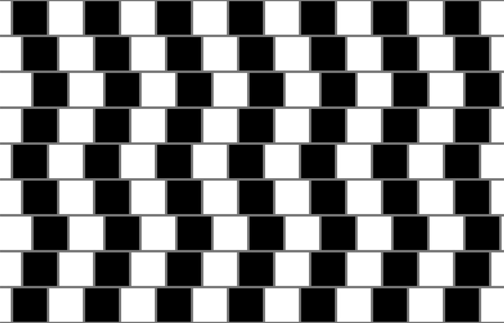

<h1>Cafe Wall</h1>

This illusion consists of a checkerboard-like arrangement, in which individual rows have been displaced. Look at the grey horizontal lines between the rows of the board. Are they parallel to one another?

*taken from The Illusions Index*

[Preview](https://editor.p5js.org/arthurfincham/sketches/pk0z4QVyN) of my p5.js rendition!

<h2>Original Illusion</h2>
