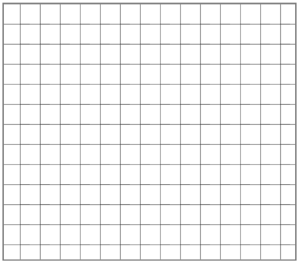
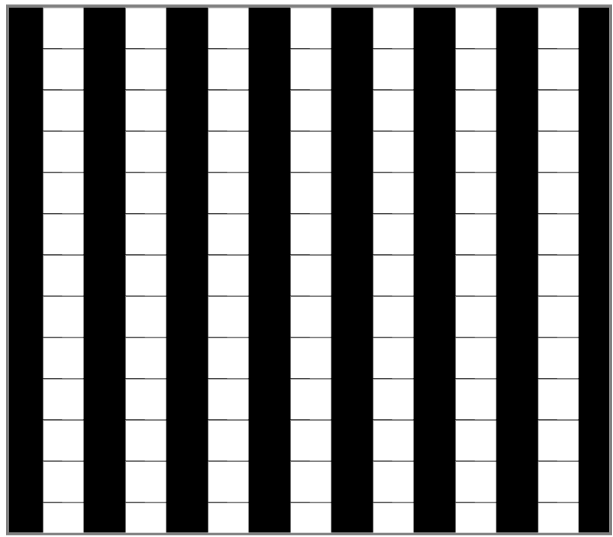
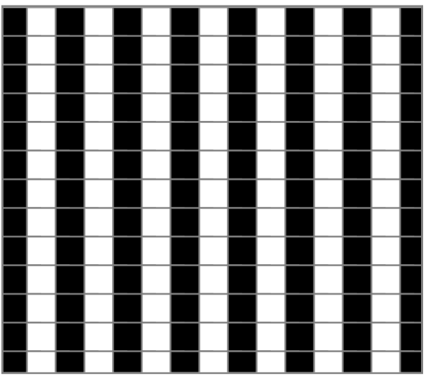
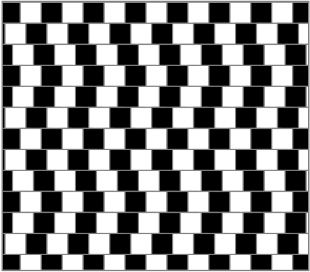

<br><br> 

This illusion consists of a checkerboard-like arrangement, in which individual rows have been displaced. Look at the grey horizontal lines between the rows of the board. Are they parallel to one another?

*taken from The Illusions Index*

#### 1. The ```setup()``` function runs once as the page loads, and we will create a canvas on our page that is 750px by 750px by using ```createCanvas(x, y)``` .

``` Javascript
function setup() {
  createCanvas(750, 750);
}
```

#### 2. Then, we use the ```draw()``` function to get creative. The ```background()``` sets the background for our page - in this case, a shade of gray.

``` Javascript
function draw() {
  background(150);
}
```


Our page should now look like this:


The background has been set to 150 to see that our canvas is ready. Now, we can change it to 255.

### 3. Now, we need to create a grid of squares.

First, we must define two variables which will determine the space inbetween our squares:

``` Javascript
x_jump = 55;
y_jump = 55;
```

To do so, we must use a nested ```for loop``` . This will iterate through the x-axis and y-axis. 

``` Javascript
for (var j = 0 ; j < 30; j++) {
      for (var i = 0; i < 30; i++) {
      }
}
```
Once we add our p5 ```rect```, our code should look like this:
``` Javascript
function setup() {
  createCanvas(800, 700);
}

function draw() {
  background(255);

  for (var j = 0 ; j < 30; j++) {
        for (var i = 0; i < 30; i++) {
        rect(i * x_jump - 10, j * y_jump, 80, 90);
        }
  }
```

and our canvas should appear as:



#### 4. Add color to each column in the grid.

To make one column black and the next white, we need to add an if loop to our code.

As each square is produced by an iteration of i, we can tell p5 to color a square to be **black** if i is even and **white** if i is even.

Our for loop will look as so:
``` Javascript
for (var j = 0 ; j < 30; j++) {
      for (var i = 0; i < 30; i++) {
        if (j % 2 == 0) {
          fill(0);
        } else {
          fill(255);
        };if (i % 2 == 0) {
          fill(0);
        } else {
          fill(255);
        };
        rect(i * x_jump - 10, j * y_jump, 80, 90);
      }
    }
```
and our canvas:



#### 5. Add stroke to the squares.

To distinguish each square from the next, we'll add a stroke.
``` Javascript
  stroke('grey');
  strokeWeight(3.3);
```
The top of our ```draw()``` function should look like this:
``` Javascript
function draw() {
  background(255);
  x_jump = 55;
  y_jump = 55;
  stroke('grey');
  strokeWeight(3.3);
...
```
and our canvas:



#### 6. Finally, we need to offset the rows to create the illusory effect.

How do we do this? Just as used an if statement to color each column of the grid, we will use an if statement to offset the rows.

Here, we will check if the value of j is divisible by 3, 2 or otherwise. In each respective case, the offset of the row will be added.

``` Javascript
if (j % 3 == 0){
  rect(i * x_jump - 10, j * y_jump, 80, 90);
} else if (j % 2 == 0){
  rect(i * x_jump - 30, j * y_jump, 100, 60);
} else {
  rect(i * x_jump - 50, j * y_jump, 90, 60);
}
```

This offset is determined by how many pixels we subtract from the x position of the squares.
``` Javascript
j % 3 == 0
x position - 10
```
``` Javascript
j % 2 == 0
x position - 30
```
``` Javascript
else
x position - 50
```

# Final Product



``` Javascript
function setup() {
  createCanvas(800, 700);
}

function draw() {
  background(255);
  x_jump = 55;
  y_jump = 55;
  stroke('grey');
  strokeWeight(3.3);

    for (var j = 0 ; j < 30; j++) {
      for (var i = 0; i < 30; i++) {
        if (j % 2 == 0) {
          fill(0);
        } else {
          fill(255);
        };if (i % 2 == 0) {
          fill(0);
        } else {
          fill(255);
        };
        if (j % 3 == 0){
          rect(i * x_jump - 10, j * y_jump, 80, 90);
        } else if (j % 2 == 0){
          rect(i * x_jump - 30, j * y_jump, 100, 60);
        } else {
          rect(i * x_jump - 50, j * y_jump, 90, 60);
        }
      }
    }


}
```