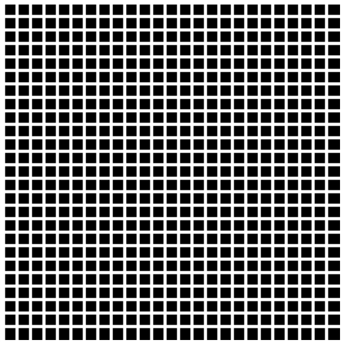

<h1>Hermann Grid</h1>

<figure style="display: flex; justify-content: space-between; align-items: center;">
  <figcaption>The Hermann grid illusion is an optical illusion reported by Ludimar Hermann in 1870.[1] The illusion is characterized by "ghostlike" grey blobs perceived at the intersections of a white (or light-colored) grid on a black background. The grey blobs disappear when looking directly at an intersection.</figcaption>
  
</figure>

# :art: Canvas Set Up

To get started with p5, we need two functions in our code:

#### 1. The ```setup()``` function runs once as the page loads, and we will create a canvas on our page that is 750px by 750px by using ```createCanvas(x, y)``` .

``` Javascript
function setup() {
  createCanvas(750, 750);
}
```

#### 2. Then, we use the ```draw()``` function to get creative. The ```background()``` sets the background for our page - in this case, a shade of gray.

``` Javascript
function draw() {
  background(150);
}
```


Our page should now look like this:


The background has been set to 150 to see that our canvas is ready. Now, we can change it back to 0.

#### 3. Then, we need to generate the vertical lines. 

This could be done one by one, but it would take a long, long time. Thankfully, p5 lets us use a for loop.

``` Javascript
  for (var i = 0; i < 25; i++){ 
    line(width/25*i, 0, width/25*i, height)
  }
```
<details>
  <summary><strong>How does this loop work?</strong></summary>

Our for loop is telling p5 to do a few things. 

First, we are asking it to iterate through i where i goes from 0 - 25.

``` Javascript
i = 0: i < 25
```

Then, we make sure i goes up by 1.

``` Javascript
i++
```

Next, we get p5 to create a line, the notation of which is:

``` Javascript
line(x1, y1, x2, y2)
```

As these are our vertical lines, we can set the y values to be the height of the canvas and 0.

``` Javascript
line(x1, 0, x2, height)
```

To ensure that we have 25 lines going across the canvas, we divide the width of the canvas by 25 before multiplying the value by i.

``` Javascript
line(width/25*i, 0, width/25*i, height)
```

</details>

If we check our canvas now, however, it will render a black square. Not quite what we are looking for! The reason is that we have not yet styled the lines. 

#### 5. To do so, we must add some properties.

``` Javascript
  stroke('white');
  strokeWeight(7);
```

Here, we have told p5 to make our lines white and 7 pixels wide.


<figure style="display: flex; justify-content: space-between; align-items: center;">
  <figcaption>If we save our code and check back on the canvas, it should look like this:</figcaption>
  
</figure>


#### 6. Finally, we need to add another loop to get our horizontal lines.

This will be pretty much the same as the first loop, but with the height and width values switched around.

``` Javascript
for (var i = 0; i < 25; i++){ 
    line(0, height/25*i, width, height/25*i)
  }
```

Make sure that the values are in the right place!

# :star: Final Product



``` Javascript
function setup() {
  createCanvas(750, 750);
}

function draw() {
  background(0);

  // LINE STYLE
  stroke('white');
  strokeWeight(7);

  // VERTICAL LINES
  for (var i = 0; i < 25; i++){ 
    line(width/25*i, 0, width/25*i, height)
  }

  // HORIZONTAL LINES
  for (var i = 0; i < 25; i++){ 
    line(0, height/25*i, width, height/25*i)
  }

}
```