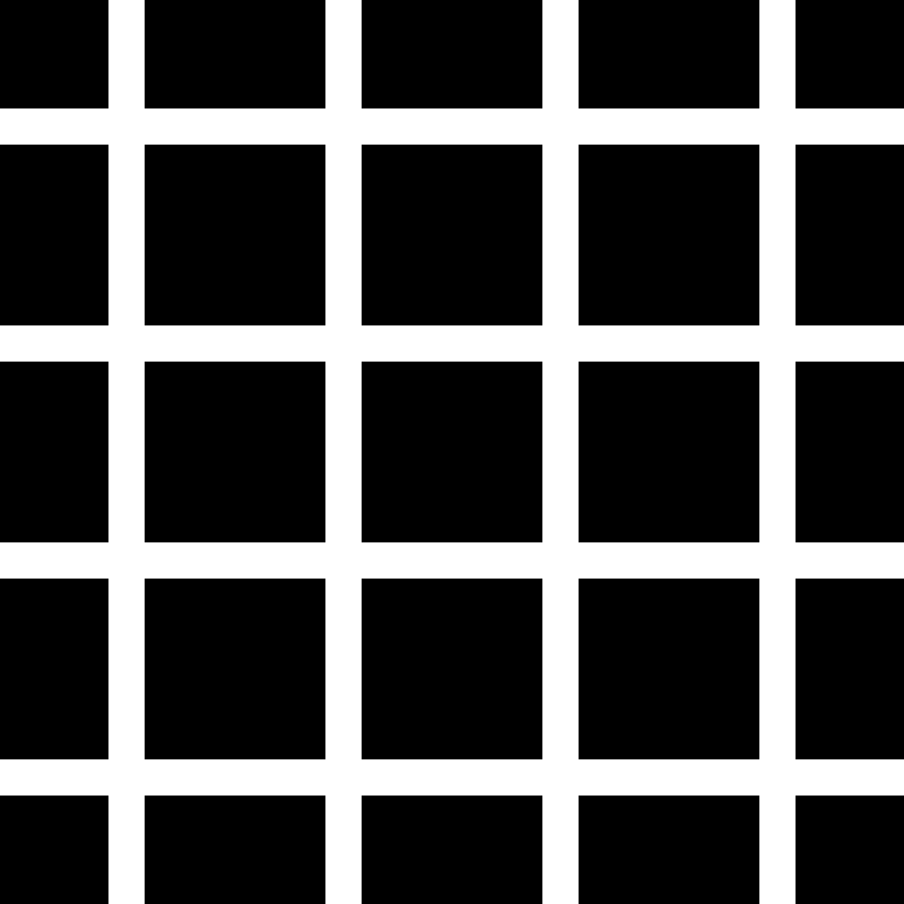

<h1>Hermann Grid</h1>

The Hermann grid illusion is an optical illusion reported by Ludimar Hermann in 1870.[1] The illusion is characterized by "ghostlike" grey blobs perceived at the intersections of a white (or light-colored) grid on a black background. The grey blobs disappear when looking directly at an intersection.

*taken from Wikipedia*

[Preview](https://preview.p5js.org/arthurfincham/present/D-3Ty82rT) of my p5.js rendition!

<h2>Original Illusion</h2>
