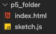
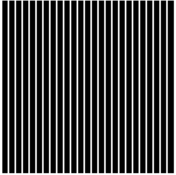
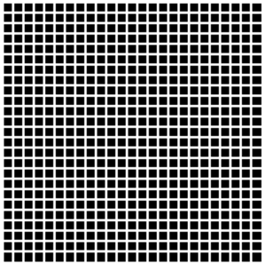

<h1>Hermann Grid</h1>


<p style="min-height: 200px;"> The Hermann grid illusion is an optical illusion reported by Ludimar Hermann in 1870.[1] The illusion is characterized by "ghostlike" grey blobs perceived at the intersections of a white (or light-colored) grid on a black background. The grey blobs disappear when looking directly at an intersection.<br><br><i>taken from Wikipedia</i></p>


<h1>p5.js Setup</h1>
 

First we need to set up p5.js. 

---


1. To include the p5.js library in your script, go to the [**CDN page**](https://cdnjs.com/libraries/p5.js) - here you will find the latest version.


2. Then, we can include the link in a ```<script>``` tag in our HTML ```<head>``` .

Our HTML should now look as follows:

``` HTML
<!DOCTYPE html>
<html>
  <head>
    <meta charset="utf-8">
    <meta http-equiv="X-UA-Compatible" content="IE=edge">
    <title>Hermann Grid</title>
    <meta name="description" content="">
    <meta name="viewport" content="width=device-width, initial-scale=1">
    <script src="https://cdnjs.cloudflare.com/ajax/libs/p5.js/1.4.0/p5.min.js"></script>
  </head>
  <body>

  </body>
</html>
```
---
3. Next, we need to create a ```script.js``` file.

Our file structure should now look like:



---
4. Finally, we include a ```<script>``` tag in the ```<body>``` of our HTML. Our code is...
``` HTML
<!DOCTYPE html>
<html>
  <head>
    <meta charset="utf-8">
    <meta http-equiv="X-UA-Compatible" content="IE=edge">
    <title>Hermann Grid</title>
    <meta name="description" content="">
    <meta name="viewport" content="width=device-width, initial-scale=1">
    <script src="https://cdnjs.cloudflare.com/ajax/libs/p5.js/1.4.0/p5.min.js"></script>
  </head>
  <body>
    <script src="sketch.js"></script>
  </body>
</html>
```
... and we are ready to code!

---
This may seem strange - there is no ```<canvas>``` tag in our HTML as one might expect. Our ```sketch.js``` file will create one!

# Canvas Set Up

To get started with p5, we need two functions in our code:

``` Javascript
function setup() {
  createCanvas(750, 750);
}

function draw() {
  background(150);
}
```
1. The ```setup()``` function runs once as the page loads, and we will create a canvas on our page that is 750px by 750px by using ```createCanvas(x, y)``` .

2. Then, we use the ```draw()``` function to get creative. The ```background()``` sets the background for our page - in this case, a shade of gray.

Our page should now look like this:


---


3. The background has been set to 150 to see that our canvas is ready. Now, we can change it back to 0.

4. Then, we need to generate the vertical lines. This could be done one by one, but it would take a long, long time. Thankfully, p5 lets us use a for loop.

``` Javascript
  for (var i = 0; i < 25; i++){ 
    line(width/25*i, 0, width/25*i, height)
  }
```
### How does this loop work?

Our for loop is telling p5 to do a few things. 

First, we are asking it to iterate through i where i goes from 0 - 25.

``` Javascript
i = 0: i < 25
```

Then, we make sure i goes up by 1.

``` Javascript
i++
```

Next, we get p5 to create a line, the notation of which is:

``` Javascript
line(x1, y1, x2, y2)
```

As these are our vertical lines, we can set the y values to be the height of the canvas and 0.

``` Javascript
line(x1, 0, x2, height)
```

To ensure that we have 25 lines going across the canvas, we divide the width of the canvas by 25 before multiplying the value by i.

``` Javascript
line(width/25*i, 0, width/25*i, height)
```

---

If we check our canvas now, however, it will render a black square. Not quite what we are looking for! The reason is that we have not yet styled the lines. 

5. To do so, we must add some properties.

``` Javascript
  stroke('white');
  strokeWeight(7);
```

Here, we have told p5 to make our lines white and 7 pixels wide.

If we save our code and check back on the canvas, it should look like this:



---

6. Finally, we need to add another loop to get our horizontal lines.

This will be pretty much the same as the first loop, but with the height and width values switched around.

``` Javascript
for (var i = 0; i < 25; i++){ 
    line(0, height/25*i, width, height/25*i)
  }
```

Make sure that the values are in the right place!

# Final Product



``` Javascript
function setup() {
  createCanvas(750, 750);
}

function draw() {
  background(0);

  // LINE STYLE
  stroke('white');
  strokeWeight(7);

  // VERTICAL LINES
  for (var i = 0; i < 25; i++){ 
    line(width/25*i, 0, width/25*i, height)
  }

  // HORIZONTAL LINES
  for (var i = 0; i < 25; i++){ 
    line(0, height/25*i, width, height/25*i)
  }

}
```