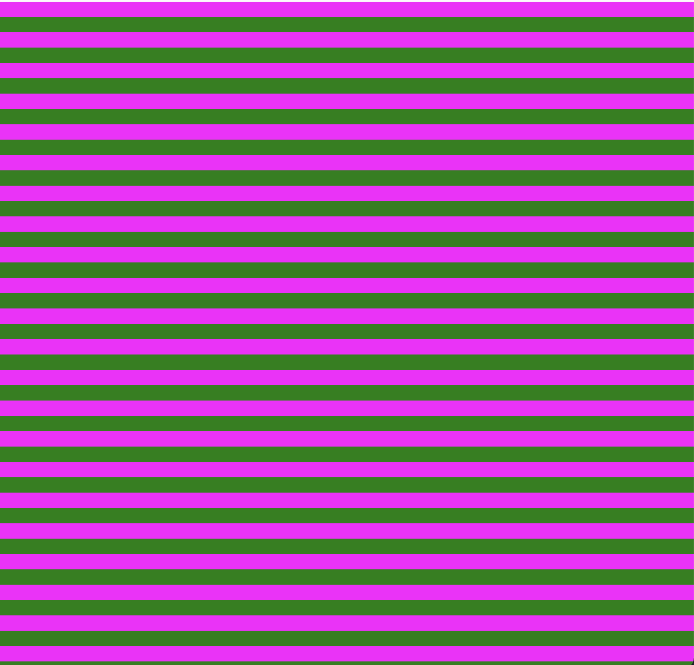

<h1>Munker White Illusion</h1>
<div align="center">


The illusion relies on the hue of the foreground stripes, not the colors in the background behind the spheres. So, if you remove the crisscrossing stripes, the illusion disappears, leaving only identical beige balls.
</div>

*taken from [livescience.com](https://www.livescience.com/confetti-munker-white-optical-illusion.html)*

# :art: Canvas Set Up

To get started with p5, we need two functions in our code:

#### 1. The ```setup()``` function runs once as the page loads, and we will create a canvas on our page that is 750px by 750px by using ```createCanvas(x, y)``` .

``` Javascript
function setup() {
  createCanvas(750, 750);
}
```

#### 2. Then, we use the ```draw()``` function to get creative. The ```background()``` sets the background for our page - in this case, a shade of gray.

``` Javascript
function draw() {
  background(150);
}
```


Our page should now look like this:


The background has been set to 150 to see that our canvas is ready. Now, we can change it back to 255 to get a white background.

#### 3. Then, we need to generate the horizontal lines. 

This could be done one by one, but it would take a long, long time. Thankfully, p5 lets us use a for loop. We also need two sets of lines to create alternating colors. How do we do this? 

With some basic logic. For each line we assign a number to the variable i. If this variable is even, the line is colored with magenta. If the variable is odd, the line is colored with green.

``` Javascript
  noStroke();
  for (var i = 0; i < 50; i++){
    if (i % 2 == 0) {
      fill('magenta');
      rect(0, 750/50 * i, width)
  } else {
    fill('green');
      rect(0, 750/50 * i, width)
  }
}
```

Our page should now look like this:




#### 4. Add the circles - or rectangles, in our case.

To get a glimpse of the Munker White illusion, we need to add two columns of the same color. The contrast between these two is what creates the illusion.

Each column will be striped with magenta and green, respectively. As always, a loop will do the trick.

``` Javascript
 noStroke();
  for (var i = 0; i < 50; i++){
    if (i % 2 == 0) {
      fill('magenta');
      rect(width*0.2, 750/50 * i, width*0.2)
  } else {
    fill(255, 238, 138);
      rect(width*0.2, 750/50 * i, width*0.2)
  }
}
```
``` Javascript
  noStroke();
  for (var i = 0; i < 50; i++){
    if (i % 2 == 0) {
      fill(255, 238, 138);
      rect(width*0.6, 750/50 * i, width*0.2)
  } else {
    fill('green');
      rect(width*0.6, 750/50 * i, width*0.2)
  }
}
```

As you can see here, the yellow of the columns is exactly the same.
``` Javascript
fill(255, 238, 138);
```

Yet when we render the illusion, they look different!

# :star: Final Product
<div align="center">

</div>